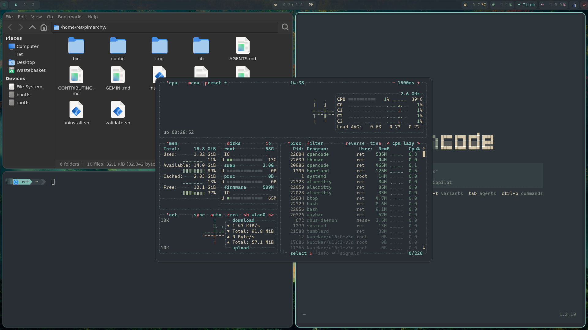

# Pimarchy (Arch Linux ARM + Hyprland)

A lightweight, aesthetic Omarchy-inspired desktop transformation for Raspberry Pi 5 / 500 running Arch Linux ARM with Hyprland.



## Overview

Pimarchy transforms a barebones Arch Linux ARM installation into a fully configured, aesthetic, and functional Wayland desktop environment using:

- **Hyprland** (window manager)
- **Waybar** (status bar)
- **Rofi** (app launcher + power menu)
- **Mako** (notifications)
- **Alacritty** (terminal)
- **Tuigreet / Greetd** (login manager)

## Prerequisites

1. A Raspberry Pi 5 or Pi 500
2. MicroSD card or USB drive flashed with **Arch Linux ARM** (aarch64) using the `linux-rpi` kernel.
3. An active internet connection.

## Installation

1. Connect to your Arch Linux ARM installation (either directly via TTY or via SSH).
2. Clone this repository:
   ```bash
   git clone https://github.com/yourusername/pimarchy.git
   cd pimarchy
   ```
3. Run the installer:
   ```bash
   bash install.sh
   ```
4. The script will install yay (AUR helper), fetch all necessary packages, process configuration templates, and set up the Greetd login manager.
5. Reboot your system.

## Configuration

Pimarchy uses a template system. To customize your setup:

1. Edit `config/theme.conf` to change colors, fonts, and themes.
2. Re-run `bash install.sh` to regenerate and apply the configurations.

For keybinds, edit `~/.config/hypr/hyprland.conf` directly.

## Uninstallation

To revert back to the default Arch Linux terminal state:

```bash
bash uninstall.sh
```