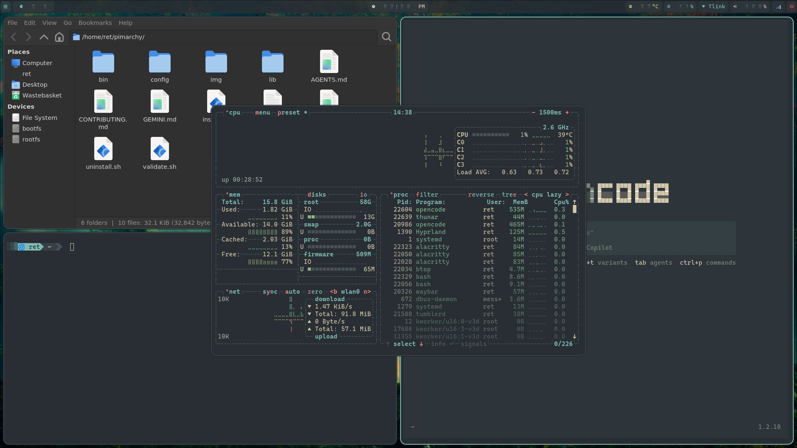

# Pimarchy

A lightweight, aesthetic Omarchy-inspired desktop transformation for Raspberry Pi 5 / Pi 500 running **Pi OS Lite (Debian Trixie)**.



## Overview

Pimarchy provisions a barebones Pi OS Lite installation into a fully configured, modern Wayland desktop environment:

| Component | Tool |
|-----------|------|
| Window manager | Hyprland (Wayland, from Debian sid — pinned; see [docs](docs/development/sid-policy.md)) |
| Status bar | Waybar |
| App launcher | Rofi (+ power menu) |
| Notifications | Mako |
| Terminal | Foot (default terminal) |
| Login manager | Greetd + Tuigreet |
| Shell | Bash + Starship + custom aliases |
| File manager | Thunar |
| Browser | Chromium (default browser) |
| Code editor | Zed (Rust-based, default editor) |
| AI coding agent | Raven (default agent, with Ollama) — `pimarchy agent`, Super+Shift+Ctrl+A |
| CLI tools | fd, ripgrep, gh (Rust-based where possible) |
| System monitor | btop (Ravenwood theme) |
| Firewall | ufw (Default Deny Incoming) |

**Lazy modules** (not installed by default — memory efficiency first):

```bash
pimarchy install dev      # Rust (rustup), Node.js, Go, Python, Docker CE, build tools
pimarchy install office   # LibreOffice (Writer, Calc, Impress)
```

All components are themed with the **Ravenwood** palette — a refined dark forest aesthetic based on Everforest.

---

## Requirements

- Raspberry Pi 5 or Pi 500
- MicroSD card / USB drive flashed with **Pi OS Lite (64-bit, Debian Trixie)**
- Active internet connection
- At least 8 GB of storage (16 GB+ recommended)

---

## Step-by-Step Setup

### 1. Flash Pi OS Lite

Download and flash **Raspberry Pi OS Lite (64-bit)** using the [Raspberry Pi Imager](https://www.raspberrypi.com/software/).

In the Imager's advanced settings (click the gear icon) before flashing:
- Set a hostname (e.g. `pimarchy`)
- Create a user account (e.g. `ret`) with a password
- Enable SSH if you want to connect remotely
- Configure your Wi-Fi credentials if needed

### 2. First Boot — Update the OS

Boot into Pi OS Lite (you will land at a TTY prompt). Log in and fully update the system:

```bash
sudo apt update && sudo apt full-upgrade -y
sudo reboot
```

> `full-upgrade` is required (not just `upgrade`) to allow Debian to resolve dependency changes correctly. This is important because Pimarchy adds the Debian Sid repository for Hyprland.

### 3. Install Pimarchy

Run the web installer. This single command will configure Git (prompting for Name/Email if not set), download Pimarchy, and launch the installer.

```bash
curl -sL https://raw.githubusercontent.com/raythurman2386/pimarchy/main/netinstall.sh | bash
```

**Installer Options**
The web installer accepts arguments by passing them at the end of the command:
- `... | bash -s -- --dry-run`: Preview changes without installing.
- `... | bash -s -- --performance`: Set CPU to 'performance' governor (safe).
- `... | bash -s -- --overclock`: Governor + 2.6 GHz overclock (requires cooling).

---

## Managing Pimarchy (CLI Tool)

Once installed, Pimarchy includes a global CLI tool to easily manage updates and configurations.

```bash
# Fetch the latest version from GitHub — safe upgrade:
# pristine configs refresh, user-modified files are left untouched
pimarchy update

# Validate your current template configurations
pimarchy validate

# Re-run the installer (e.g. to apply a new theme.conf)
pimarchy install

# Install lazy package modules
pimarchy install dev      # Rust, Node.js, Go, Python, Docker
pimarchy install office   # LibreOffice

# Default app policy
pimarchy defaults                       # show all defaults
pimarchy default agent raven            # set the coding agent
pimarchy default browser chromium       # set the browser
pimarchy default editor zed             # set the editor
pimarchy default terminal foot          # set the terminal

# Launch the default coding agent (Quattro-style)
pimarchy agent "refactor the auth module"

# Uninstall Pimarchy and restore original config backups
pimarchy uninstall
```

---

## Advanced: Manual Setup

If you prefer to clone and run the installer manually:

```bash
# 1. Install git
sudo apt install -y git

# 2. Clone the repository
git clone https://github.com/raythurman2386/pimarchy.git ~/.local/share/pimarchy
cd ~/.local/share/pimarchy

# 3. Run a dry run to see what will be installed
bash install.sh --dry-run

# 4. Run the installer
bash install.sh
```

The installer will:

1. **Back up** your existing configs to `~/.config/Pimarchy-backup/`
2. **Update the system** and add the required apt repositories:
   - Debian Sid (for the latest Hyprland — pinned; see the [sid policy](docs/development/sid-policy.md))
   - Official Docker CE repository (only used if you later install the dev module)
3. **Install the core module** (data-driven from `config/packages/core.list`): the Hyprland session stack, Foot, Rofi, Mako, Greetd, Tuigreet, Starship, Thunar, btop, Chromium, plus Zed, Raven, and Ollama via their official install scripts
4. **Deploy all configuration files** using the Ravenwood theme, honoring the default app policy (`pimarchy default ...`)
5. **Configure Greetd** as the login manager, replacing the default console login
6. **Prompt for CPU performance mode** (optional):
   - `g` — Governor only: keeps CPU at max clock, safe on all units, no reboot needed
   - `o` — Overclock: `arm_freq=2600` (2.6 GHz, up from 2.4 GHz) — requires active cooling and a reboot
   - `N` — Skip: leave CPU settings unchanged

Upgrading from a pre-Quattro install? See the [migration note](docs/development/defaults.md#migration-for-pre-quattro-users) — your packages are preserved (behind `--legacy-packages`) and `pimarchy update` will not clobber files you've edited.

Or pass flags directly to skip the interactive prompt:

```bash
bash install.sh --performance   # Governor only, no overclock
bash install.sh --overclock     # Governor + arm_freq=2600 (requires cooling)
```

### 7. Reboot

```bash
sudo reboot
```

Greetd will launch at startup. Log in with your username and password — Hyprland will start automatically.

### Optional: Enable Auto-Login

If you want your Pi to automatically login and start Hyprland on boot (useful for headless setups or ensuring services always start), run:

```bash
cd ~/.local/share/pimarchy
sudo bash enable-autologin.sh
```

This configures `greetd` to skip the login prompt and automatically start the desktop. To disable auto-login later, re-run the Pimarchy installer.

---

## Keybinds

| Shortcut | Action |
|----------|--------|
| `SUPER + D` | App launcher (Rofi) |
| `SUPER + Return` | Terminal (default terminal: Foot) |
| `SUPER + E` | File manager (Thunar) |
| `SUPER + M` | System monitor (btop) |
| `SUPER + W` | Close window |
| `SUPER + SHIFT + B` | Open browser (default: Chromium) |
| `SUPER + SHIFT + CTRL + A` | Coding agent (default: Raven, `pimarchy agent`) |
| `SUPER + F` | Toggle fullscreen |
| `SUPER + V` | Toggle floating window |
| `SUPER + K` | View all keybinds (Rofi) |
| `SUPER + Arrow keys` | Move focus |
| `SUPER + 1–0` | Switch to workspace 1–10 |
| `SUPER + SHIFT + 1–0` | Move window to workspace 1–10 |
| `Print` | Screenshot — select region → `~/Pictures/Screenshots/` |
| `SHIFT + Print` | Screenshot — full screen → `~/Pictures/Screenshots/` |

## Waybar Actions

| Action | Result |
|--------|--------|
| Click clock | Toggle date/time format |
| Click workspaces | Cycle to next workspace |
| Click update icon | Run system update (if available) |
| Right-click workspaces | Cycle to previous workspace |
| Right-click WiFi | Open network settings |
| Click volume | Open audio mixer (pavucontrol) |
| Scroll on volume | Adjust volume |
| Click CPU / Memory | Open system monitor (btop) |
| Click power icon | Power menu (shutdown / reboot / logout) |

---

## Firewall

Pimarchy automatically configures `ufw` (Uncomplicated Firewall) to secure your system:
- **Default Incoming:** Deny
- **Default Outgoing:** Allow
- **SSH (Port 22):** Limited (rate-limited to prevent brute-force attacks)

To manage firewall rules, use standard ufw commands: `sudo ufw status`.

---

## Configuration

All theming is driven by a single file:

```
config/theme.conf   # colours, fonts, icons, spacing
```

Edit it and re-run `bash install.sh` to regenerate and apply every configuration file. Individual configs can also be edited directly under `~/.config/` after install.

---

## Uninstallation

```bash
bash uninstall.sh
```

Restores your original configuration backups, optionally removes installed packages, and reverts the boot environment to standard Pi OS console defaults.

---

## Validation

```bash
bash validate.sh
```

Checks script syntax, template variables, and file existence. Run this before every commit.

---

## Project Structure

```
├── install.sh                  # Main provisioning script (thin orchestrator)
├── uninstall.sh                # Reverts everything
├── validate.sh                 # Pre-commit validator
├── lib/                        # Library modules (sourced via functions.sh)
│   ├── functions.sh            #   aggregator — sources all modules below
│   ├── common.sh               #   shared paths & constants
│   ├── log.sh                  #   logging
│   ├── template.sh             #   {{VARIABLE}} template engine
│   ├── backup.sh               #   config backup/restore
│   ├── repos.sh                #   apt repositories (sid, Docker CE)
│   ├── packages.sh             #   list-driven package modules
│   ├── services.sh             #   systemd/greetd/firewall/keyboard
│   ├── pi-perf.sh              #   Pi 5 governor / overclock
│   ├── apps.sh                 #   app installs, gsettings, cleanup
│   ├── defaults.sh             #   default app policy (Quattro)
│   └── upgrade.sh              #   safe upgrade model (Quattro)
├── bin/                        # CLI + wrapper scripts
│   ├── pimarchy                #   main CLI (install/defaults/agent/update/...)
│   ├── pimarchy-agent          #   default agent launcher
│   ├── pimarchy-default-agent  #   default agent setter
│   ├── pimarchy-install        #   lazy module installer
│   └── pimarchy-upgrade        #   safe upgrade applier
├── config/
│   ├── theme.conf              # Centralised theme variables
│   ├── modules.conf            # Module registry (template → target)
│   ├── packages/               # Package lists as data
│   │   ├── core.list           #   always installed
│   │   ├── dev.list            #   lazy: Rust/Node/Go/Python/Docker
│   │   ├── office.list         #   lazy: LibreOffice
│   │   └── retired.conf        #   files removed on upgrade
│   ├── hypr/                   # Hyprland config, keybinds, wallpaper, screenshots
│   ├── waybar/                 # Waybar config + CSS
│   ├── rofi/                   # Rofi launcher + power menu
│   ├── mako/                   # Mako notification daemon config
│   ├── terminal/               # Foot config
│   ├── shell/                  # Bash aliases
│   ├── starship/               # Starship prompt
│   ├── gtk/                    # GTK2 / GTK3 theme settings
│   ├── btop/                   # btop config + Ravenwood colour theme
│   └── raven/                  # Raven agent config
├── tests/                      # Functional tests (run by validate.sh)
└── .github/workflows/          # CI — syntax + permission checks
```

---

## Backup System

- First install backs up original configs to `~/.config/Pimarchy-backup/`
- Subsequent installs create timestamped snapshots: `previous-YYYYMMDD-HHMMSS/`
- `uninstall.sh` restores from the original backup

---

## Acknowledgements

Inspired by [Omarchy](https://github.com/basecamp/omarchy) by Basecamp / DHH.
